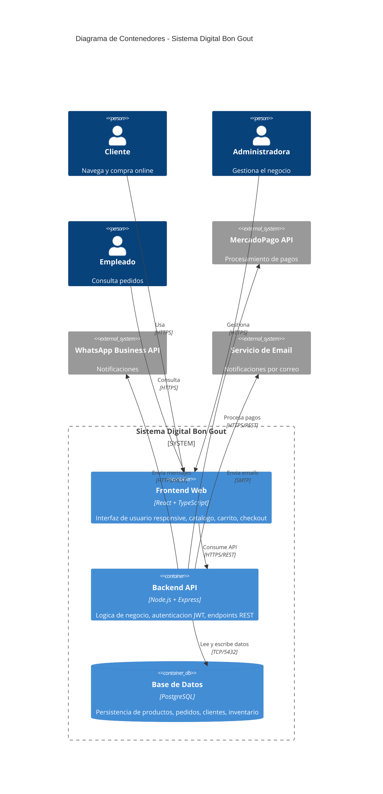

# C4 Nivel 2 - Contenedores del Sistema Bon Gout

## Diagrama de Contenedores

## Descripcion

El sistema se compone de tres contenedores principales:

1. Frontend Web (React + TypeScript): Interfaz responsive que expone el catalogo,
   carrito de compras y panel de administracion. Construido con Vite.

2. Backend API (Node.js + Express): Capa de logica de negocio con endpoints REST.
   Maneja autenticacion JWT, validacion de datos y orquestacion de servicios externos.

3. Base de Datos (PostgreSQL): Persistencia relacional ACID para productos, pedidos,
   clientes, inventario y usuarios.

Los contenedores se comunican entre si mediante HTTPS/REST (frontend-backend) y
TCP puerto 5432 (backend-postgreSQL). El backend se conecta con servicios externos
(MercadoPago, WhatsApp, Email) mediante HTTPS/REST y SMTP.
