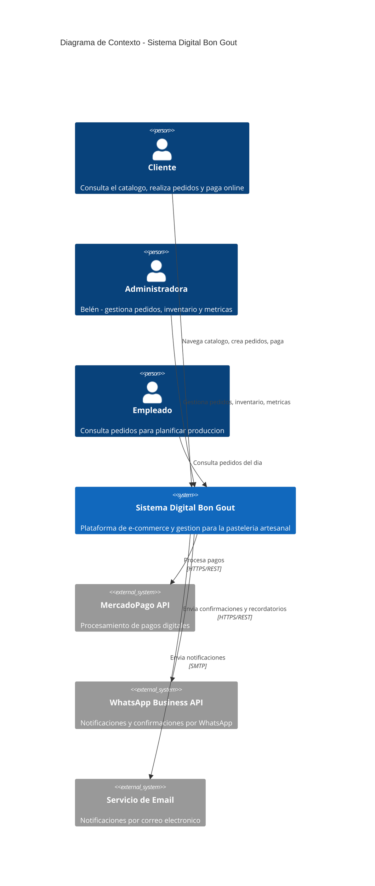

# C4 Nivel 1 - Contexto del Sistema Bon Gout

## Diagrama de Contexto

## Descripcion

El sistema Bon Gout se presenta como una caja negra que interactua con tres actores
humanos (cliente, administradora y empleado) y tres sistemas externos (MercadoPago,
WhatsApp Business y un servicio de email). El cliente utiliza la plataforma para
navegar el catalogo, personalizar productos y realizar pagos. La administradora
gestiona el negocio desde un dashboard. El empleado consulta la lista de pedidos
para planificar la produccion diaria.
