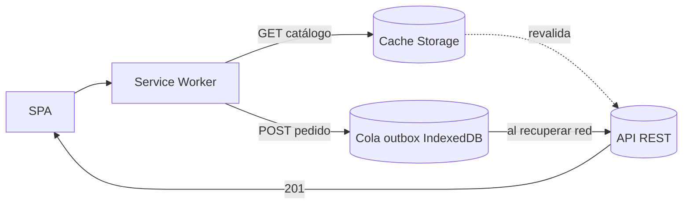

# Offline + Sync — Bon Gout PWA

**Fecha:** 2026-09-22
**Estrategia elegida:** caché de lectura + cola de escritura (no es Non-Goal:
Martín compra con 4G inestable y el catálogo debe abrir sin señal).

## Reglas

1. **Lectura:** `GET /api/productos*` con estrategia stale-while-revalidate;
   imágenes en caché dedicada con tope de 50 entradas.
2. **Escritura:** `POST /api/pedidos` y carrito se guardan en outbox (IndexedDB)
   si no hay red; al reconectar se reintentan en orden con idempotencia por
   `clienteId + fechaPedido` (el servidor rechaza duplicados <48h ya cubiertos
   por validación de negocio).
3. **Conflictos:** el stock se valida en servidor al sincronizar; si un producto
   se agotó, la UI muestra el error `400` del contrato y vacía ese ítem de la
   cola (sin reintento infinito).
4. **Límite:** la cola guarda máximo 20 operaciones; superado, se pide conexión.
